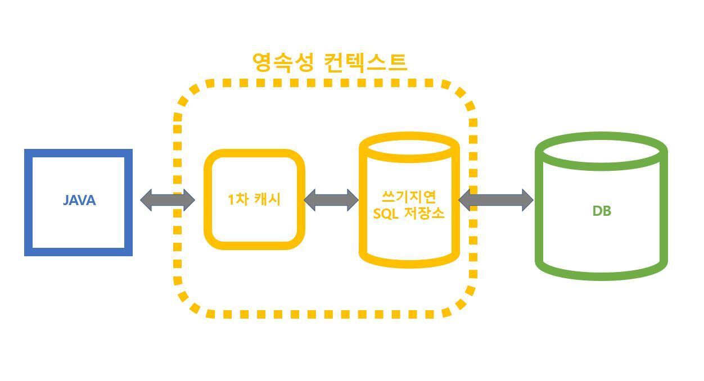
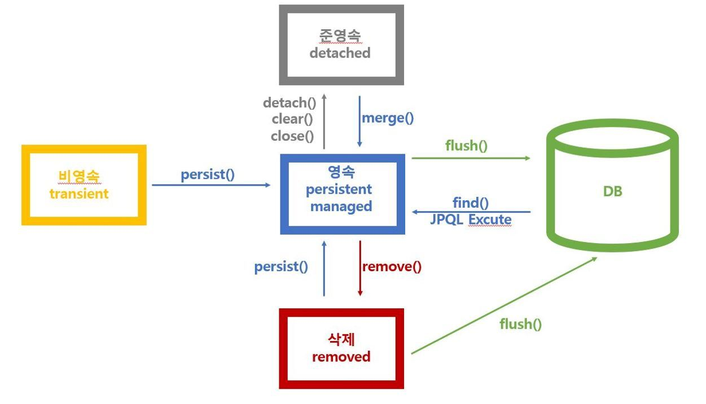
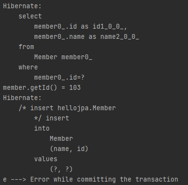

# 2주차 회의(2021-02-10)

## 스터디 내용

### 1. 강의 내용 복습

 - maven으로 프로젝트 생성
 - pom.xml에 dependencies 추가
 - resources/META-INF에 persistence.xml 파일 생성 및 persistence 설정
 - Member Entity 생성
 - EntityManagerFactory, EntityManager, EntityTransaction 생성
 - CRUD Test
 - JPA의 영속성 컨텍스트에 관하여

<br>

**영속성 컨텍스트 구조**  


**영속성 컨텍스트 생명주기**  


### 2. `em.remove()`와 `em.detach()`의 차이

- em.remove()  
    - 영속성 컨텍스트의 1차 캐시에 엔티티 정보가 바로 삭제된다.
    - DELETE 쿼리가 쓰기 지연 SQL 저장소에 저장된다.
    - `tx.commit()`시 DB에서 데이터가 삭제된다.

- em.detach()
    - 더 이상 JPA가 영속 관리를 하지 않는다.
    - 즉, 변경 감시(Dirty Checking), 동일성(identity) 보장, 1차 캐시 등 영속성 컨텍스트의 이점을 누릴 수 없다.
    - 영속성 컨텍스트의 1차 캐시엔 데이터가 남아있다.

<br>

**em.detach() 실험**

```
/* 
    예상 시나리오
    1. 101 번으로 등록된 객체를 1차 캐시에 등록
    2. em.detach(member);를 통해 member 엔티티를 준영속 상태로 만듬
    3. 준영속 상태이므로 변경 감지를 하지 않아 member.setId(103L);을 해도 UPDATE 쿼리가 쓰기 지연 SQL 저장소에 생성되지 않음
    4. UPDATE 쿼리는 생성되지 않지만 member 객체 내의 Id는 변경
    5. 1차 캐시(id 값 101)이고, 객체(id 값 103)인 상태에서 em.persist(member)를 했을 시 detach는 1차 캐시 값으로 persist를 실행하므로 중복된 id값 101로 error 발생 후 rollback 될 것
*/


try{
    Member member = em.find(Member.class, 101L);
    em.detach(member);

    member.setId(103L);
    System.out.println("member.getId() = " + member.getId());

    em.persist(member);

    tx.commit();
}catch (Exception e){
    System.out.println("e ---> "+e.getMessage());
    tx.rollback();
}finally {
    em.close();
}
```



### 3. intellij 코드 자동 정렬 Format

&nbsp; 상문님이 Format 정하시면 Slack 정보공유 채널에 올리시기로 하셨습니다.


## 다음 일정

- 강의 : 섹션 6. 다양한 연관관계 매핑 까지
- 일시 : 다음 주 수요일 (02/17)
- 장소 : zoom 회의